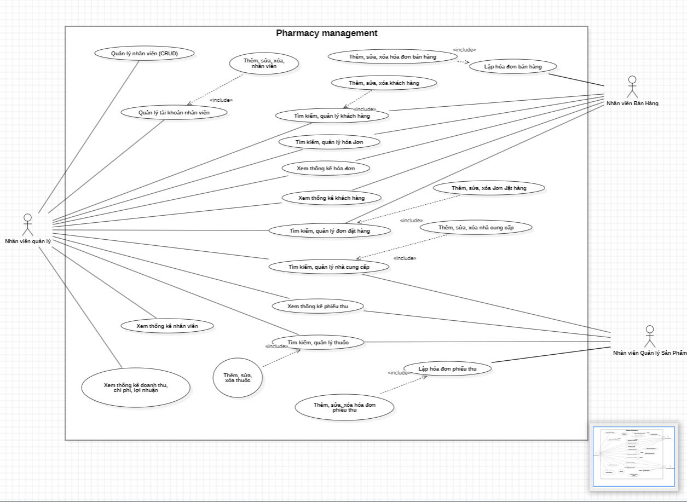
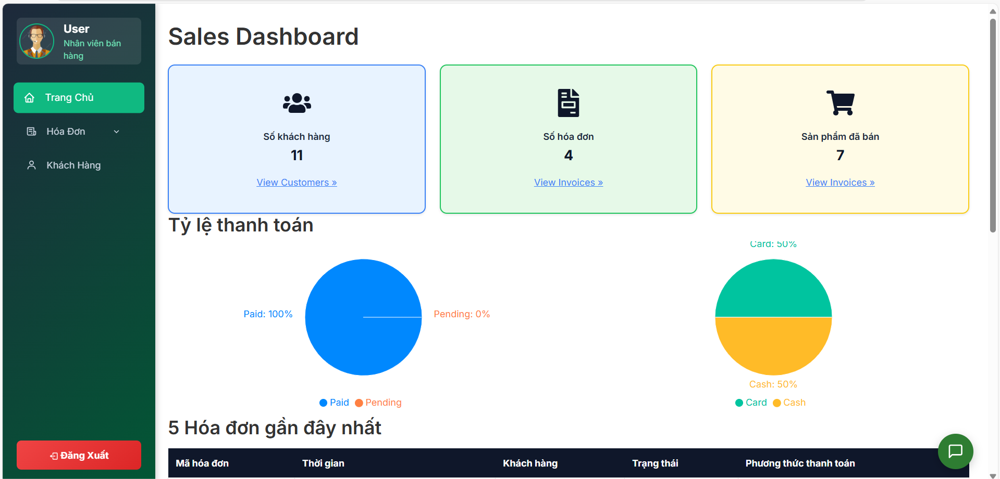

# PHARMACY MANAGEMENT

## Mục lục

1. [Thông tin nhóm](#1-thông-tin-nhóm)
2. [Mô tả đề tài](#2-mô-tả-đề-tài)
3. [Phân tích thiết kế](#3-phân-tích-thiết-kế)
4. [Công cụ và công nghệ sử dụng](#4-công-cụ-và-công-nghệ-sử-dụng)
5. [Triển khai](#5-triển-khai)
6. [Kiểm thử](#6-kiểm-thử)
7. [Kết quả](#7-kết-quả)
8. [Tài liệu tham khảo](#8-tài-liệu-tham-khảo)

## 1. THÔNG TIN NHÓM

| Họ và tên              | Email                        | Vai trò                | Phân công công việc                                  |
|------------------------|------------------------------|------------------------|------------------------------------------------------|
| Trương Long Tý         | tytruong977@gmail.com        | Backend                | Thiết kế CSDL, xây dựng API, xử lý nghiệp vụ backend |
| Nguyễn Thái Uy         | thaiuy1006@gmail.com         | Frontend               | Thiết kế UI/UX, phát triển giao diện React, tích hợp API |
| Vương Nguyễn Anh Khoa  | vnmkhoa.2910@gmail.com       | Testing                | Viết test case, kiểm thử chức năng, kiểm thử hiệu năng |
| Trần Anh Tuấn          | anhtuan59gz@gmail.com        | Deploy                 | Triển khai Docker, vận hành hệ thống  |

> **Video demo:** [Google Drive](https://drive.google.com/drive/u/0/folders/1lflXZAQC-9PlWGppBfAMvlg9ZoPFjrh4)  
> **Link triển khai:** [Pharmacy Management](http://pharmacy-management.click/)

## 2. MÔ TẢ ĐỀ TÀI

### 2.1. Mô tả tổng quan

Hệ thống Quản lý Nhà thuốc là một giải pháp phần mềm giúp các nhà thuốc quản lý hiệu quả các nghiệp vụ như quản lý thuốc, hóa đơn bán hàng, đơn đặt hàng, khách hàng, nhà cung cấp, nhân viên và báo cáo thống kê. Đề tài giải quyết các vấn đề về lưu trữ, truy xuất thông tin nhanh chóng, giảm thiểu sai sót thủ công, hỗ trợ ra quyết định và nâng cao hiệu quả vận hành nhà thuốc. Lý do chọn đề tài là nhu cầu thực tế về chuyển đổi số trong lĩnh vực y tế, đặc biệt là các nhà thuốc vừa và nhỏ.

### 2.2. Mục tiêu

- Xây dựng hệ thống quản lý nhà thuốc hiện đại, dễ sử dụng, đáp ứng nghiệp vụ thực tế.
- Hỗ trợ quản lý thông tin thuốc, khách hàng, nhân viên, nhà cung cấp, hóa đơn, đơn đặt hàng và báo cáo thống kê.
- Đảm bảo an toàn dữ liệu, phân quyền người dùng rõ ràng.
- Cung cấp giao diện thân thiện, hỗ trợ đa nền tảng (web, mobile).

## 3. PHÂN TÍCH THIẾT KẾ

### 3.1. Phân tích yêu cầu

**Yêu cầu chức năng:**
- Quản lý thông tin thuốc (thêm, sửa, xóa, tìm kiếm, xuất Excel)
- Quản lý khách hàng, nhân viên, nhà cung cấp
- Quản lý hóa đơn bán hàng, đơn đặt hàng, phiếu thu
- Thống kê, báo cáo doanh thu, chi phí, lợi nhuận
- Phân quyền tài khoản (Admin, Nhân viên bán hàng, Quản lý sản phẩm)
- Tích hợp chatbot hỗ trợ tư vấn, tra cứu thông tin, giải đáp thắc mắc cho người dùng hệ thống

**Yêu cầu phi chức năng:**
- Giao diện thân thiện, dễ sử dụng
- Đảm bảo bảo mật thông tin người dùng
- Hệ thống hoạt động ổn định, hiệu năng tốt
- Dễ dàng mở rộng, bảo trì

### 3.2. Đặc tả yêu cầu

- Quản lý thuốc: Thêm mới, chỉnh sửa, xóa, tìm kiếm thuốc theo tên/mã, xuất danh sách thuốc ra file Excel.
- Quản lý khách hàng: Thêm, sửa, xóa, tìm kiếm khách hàng, xem lịch sử mua hàng.
- Phân quyền: Tài khoản Admin có toàn quyền, nhân viên bán hàng chỉ thao tác với hóa đơn, khách hàng, nhân viên quản lý sản phẩm chỉ thao tác với thuốc, nhà cung cấp, phiếu thu.
- Báo cáo: Thống kê doanh thu, chi phí, lợi nhuận, số lượng hóa đơn, số lượng khách hàng.

### 3.3. Thiết kế hệ thống

- **Sơ đồ Use Case:**  
  <div align="center">
    <br>
    <i>Hình 1: Sơ đồ use case hệ thống quản lý nhà thuốc.</i>
  </div>

- **Thiết kế CSDL:**  
  <div align="center">
    <br>
    <i>Hình 2: Sơ đồ quan hệ các bảng trong cơ sở dữ liệu. Các bảng liên kết với nhau qua các khóa ngoại để đảm bảo tính toàn vẹn dữ liệu.</i>
  </div>

- **Thiết kế giao diện:**  
  Giao diện được thiết kế hiện đại, thân thiện với người dùng. Dưới đây là một số hình ảnh minh họa các màn hình chính của hệ thống:

  <div align="center">

  <h4>Landing Page</h4>
  <br>
  <i>Hình 3: Landing Page – Trang giới thiệu hệ thống, đăng nhập và các thông tin tổng quan về nhà thuốc.</i>

  <h4>Login Page</h4>
  <br>
  <i>Hình 4: Login Page – Trang đăng nhập vào hệ thống.</i>

  <h4>Admin Dashboard</h4>
  <br>
  <i>Hình 5: Dashboard dành cho Admin – Quản lý tổng thể hệ thống, thống kê doanh thu, số lượng thuốc, người dùng, cảnh báo hệ thống.</i>

  <h4>Sale Dashboard</h4>
  <br>
  <i>Hình 6: Dashboard dành cho Nhân viên bán hàng – Quản lý hóa đơn, khách hàng, tra cứu thuốc, tạo đơn bán hàng nhanh chóng.</i>

  <h4>Product Manager Dashboard</h4>
  <br>
  <i>Hình 7: Dashboard dành cho Nhân viên quản lý sản phẩm – Quản lý danh mục thuốc, nhà cung cấp, kiểm soát tồn kho, nhập xuất thuốc.</i>

  </div>

## 4. CÔNG CỤ VÀ CÔNG NGHỆ SỬ DỤNG

- **Ngôn ngữ lập trình:** Python (backend), JavaScript (frontend)
- **Framework:** Django REST Framework (backend), ReactJS (frontend)
- **Cơ sở dữ liệu:** PostgreSQL
- **IDE:** Visual Studio Code
- **Công cụ khác:** Docker, Git, Swagger

## 5. TRIỂN KHAI

### 5.1. Yêu cầu hệ thống

- Đã cài đặt **Docker** và **Docker Compose** trên máy.
- Không cần cài đặt Python, Node.js, PostgreSQL thủ công vì đã dùng Docker.

### 5.2. Clone mã nguồn

```sh
git clone https://github.com/iuh-application-development/Pharmacy-Management
cd Pharmacy-Management
```

### 5.3. Cấu hình biến môi trường

- Đảm bảo file `.env` đã có trong thư mục `backend`.

### 5.4. Khởi động ứng dụng bằng Docker Compose

```sh
docker-compose up --build
```

### 5.5. Truy cập ứng dụng

- **Frontend:** http://localhost:3000  
- **Backend API/Swagger:** http://localhost:8000/swagger/  
- **ReDoc:** http://localhost:8000/redoc/

### 5.6. Khởi tạo database (chạy migrations)

Mở terminal mới, chạy lệnh sau để migrate database:

```sh
docker-compose exec backend python manage.py migrate
```

Nếu muốn tạo tài khoản admin:

```sh
docker-compose exec backend python manage.py createsuperuser
```

## 6. KIỂM THỬ

- Thực hiện kiểm thử chức năng (Functional Testing) cho từng module: thuốc, khách hàng, hóa đơn, tài khoản...
- Kiểm thử hiệu năng (Performance Testing) với dữ liệu lớn, nhiều người dùng đồng thời.
- Viết unit test cho frontend (Jest) và backend (Django TestCase).

## 7. KẾT QUẢ

### 7.1. Kết quả đạt được

- Xây dựng thành công hệ thống quản lý nhà thuốc đầy đủ các chức năng nghiệp vụ.
- Giao diện trực quan, dễ sử dụng, hỗ trợ xuất file Excel, thống kê báo cáo.
- Đảm bảo phân quyền, bảo mật, kiểm thử tự động.

### 7.2. Kết quả chưa đạt được

- Chưa triển khai phiên bản mobile native.
- Chưa tích hợp thanh toán trực tuyến, gửi email tự động.

### 7.3. Hướng phát triển

- Phát triển ứng dụng mobile (Flutter/React Native).
- Kết nối với hệ thống quản lý bệnh viện/phòng khám.

## 8. TÀI LIỆU THAM KHẢO

- [Django REST Framework](https://www.django-rest-framework.org/)
- [ReactJS](https://react.dev/)
- [PostgreSQL](https://www.postgresql.org/)
- [Docker](https://docs.docker.com/)
- [Swagger](https://swagger.io/)